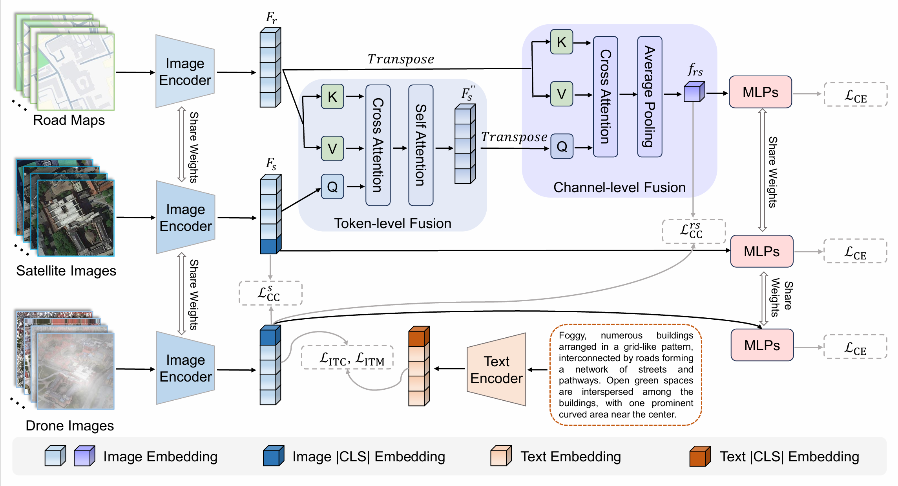

# GeoFuse

[Paper](https://arxiv.org/abs/2605.14925)



## Dataset

Download [Road Map](https://drive.google.com/file/d/1_MROR8ZFpH9F4uHjZ9woL5R_Z599AKyt/view?usp=drive_link)

## Citation

```
@article{fang2026road,
  title={Road Maps as Free Geometric Priors: Weather-Invariant Drone Geo-Localization with GeoFuse},
  author={Fang, Y and Wang, T and Zheng, Z},
  journal={arXiv preprint arXiv:2605.14925},
  year={2026}
}
```

## Related Work

Google Map [Link](https://www.google.com/maps)

Qwen-Image-Edit [Code](https://github.com/QwenLM/Qwen-Image)
